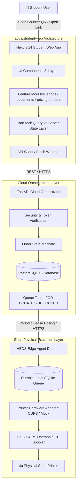
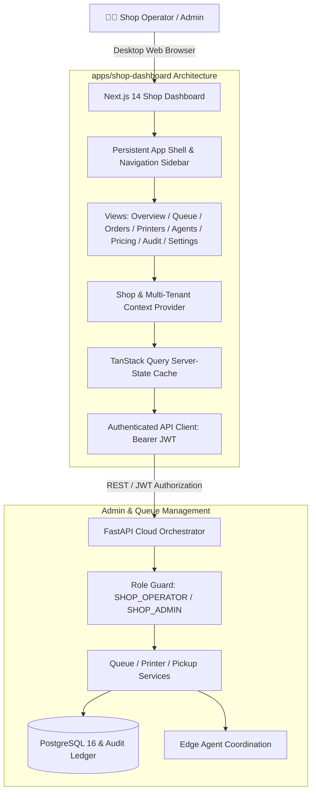

# HEDS Frontend Architecture Specification

**Applications:**
1. `apps/student-web` (Student Mobile-First PWA)
2. `apps/shop-dashboard` (Shop Operator Operations Console)

**Framework:** Next.js 14 (App Router) + TypeScript + Tailwind CSS  
**State & Data Synchronization:** TanStack React Query v5  
**Icons & Design Primitives:** Lucide React, Custom Industrial Design Tokens  

---

## 1. System-Wide Architectural Diagrams

### A. End-to-End Student Processing Layer



### B. Shop Operator Console Architecture



---

## 2. Frontend Overview & Design Principles

HEDS serves two distinct user personas with fundamentally different operational needs:

1. **Student / Customer Persona (`student-web`):**
   * **Goal:** Zero friction, zero signups. Upload file, choose settings, pay, monitor live progress, present OTP at the counter.
   * **Device Profile:** Mobile-first smartphones, mobile Safari/Chrome, scanning physical QR codes at college print counters.
   * **UX Mandate:** Fast loading (< 200KB initial bundle), instant visual feedback, clear price breakdown, prominent pickup OTP.

2. **Shop Operator Persona (`shop-dashboard`):**
   * **Goal:** High-throughput print management, queue monitoring, paper/jam recovery, cash/UPI reconciliation, hardware health inspection.
   * **Device Profile:** Desktop computers, POS counter terminals, 1080p+ monitors.
   * **UX Mandate:** High information density, keyboard navigation, persistent sidebar, real-time status indicators, low visual fatigue (restrained dark mode).

---

## 3. Student Application Architecture (`apps/student-web`)

### Directory Layout
```text
apps/student-web/src/
├── app/
│   ├── layout.tsx              # Root HTML shell, QueryProvider, Toast notifications
│   ├── page.tsx                # Fallback / Landing (directs to scan QR)
│   ├── globals.css             # Tailwind configuration & design tokens
│   ├── s/
│   │   └── [shop_slug]/
│   │       └── page.tsx        # Counter landing: Upload, Configure, Preview, Checkout
│   └── orders/
│       └── [guest_token]/
│           └── page.tsx        # Live order logistics tracker & Privacy Hold OTP
├── components/
│   ├── ui/                     # Primitives: Button, Badge, StatusDot, Modal
│   └── layout/                 # Navigation, Mobile Container, Header
├── lib/
│   ├── api.ts                  # Typed Fetch wrapper with standard error handling
│   └── queryClient.ts          # Configured TanStack Query client
└── types/                      # Type definitions for shops, orders, pricing
```

### Route Lifecycle:
1. **`/s/[shop_slug]`**:
   * Reads `shop_slug` from path params.
   * Queries `GET /api/v1/shops/{shop_slug}` via TanStack Query with 5s refetch.
   * If `is_queue_paused`, displays notice and disables submission button.
   * On file selection: validates extension (PDF, PNG, JPG) and size (max 50MB).
   * Calculates local price preview based on authoritative shop rates.
   * Submits `multipart/form-data` to `POST /api/v1/shops/{shop_slug}/orders`.
   * On 200 OK, executes payment intent `POST /api/v1/orders/{guest_token}/payment`.
   * Redirects to `/orders/{guest_token}`.
2. **`/orders/[guest_token]`**:
   * Fetches `GET /api/v1/orders/{guest_token}`.
   * Polls every 2.5s while state is non-terminal (`QUEUED`, `DISPATCHED`, `PRINTING`, `PICKUP_READY`).
   * When `PICKUP_READY`: Displays large 6-digit Privacy Hold OTP code and instructions.
   * When `COMPLETED`: Automatically stops polling and presents completion receipt.

---

## 4. Shop Dashboard Architecture (`apps/shop-dashboard`)

### Directory Layout
```text
apps/shop-dashboard/src/
├── app/
│   ├── layout.tsx              # Root HTML shell, QueryProvider
│   ├── page.tsx                # Index redirect to /dashboard or /login
│   ├── login/
│   │   └── page.tsx            # Operator email/password authentication
│   └── dashboard/
│       └── page.tsx            # Operations shell hosting all views
├── components/
│   ├── layout/
│   │   ├── Sidebar.tsx         # Persistent left navigation with badge counts
│   │   └── Header.tsx          # Current shop indicator & operator profile
│   ├── ui/
│   │   ├── Button.tsx          # Primary, secondary, danger, ghost variants
│   │   ├── Badge.tsx           # Semantic status badges
│   │   ├── Input.tsx           # Standard text, number, and search inputs
│   │   ├── Modal.tsx           # Accessible keyboard-navigable dialogs
│   │   └── EmptyState.tsx      # Clean zero-data placeholders
│   └── views/
│       ├── OverviewView.tsx    # Live metric tiles, queue overview, test print
│       ├── QueueView.tsx       # Live print job table with Retry/Cancel/Reconcile
│       ├── OrdersView.tsx      # Historical order log with status filters & search
│       ├── PrintersView.tsx    # Hardware health, capabilities, diagnostics trigger
│       ├── AgentsView.tsx      # Connected Edge PC nodes & heartbeat indicators
│       ├── PricingView.tsx     # Rate editing modal (B&W, Color, Duplex, Min)
│       ├── AuditLogsView.tsx   # Immutable security audit trail
│       ├── QrView.tsx          # Counter QR code generator
│       └── SettingsView.tsx    # Queue pause toggle and data retention settings
├── lib/
│   ├── api.ts                  # Authenticated client with automatic Bearer token
│   └── queryClient.ts          # Centralized QueryClient with retry & cache defaults
└── types/                      # Domain interfaces
```

---

## 5. Component Architecture & Design System Tokens

Both applications share a common aesthetic: **restrained, utilitarian, and high-contrast**.

### Visual Style Rules:
* **Backgrounds:** Slate-950 and Slate-900 for dark mode (Dashboard); Slate-50 and pure White for mobile student flows.
* **Borders:** Slate-800 in dark mode; Slate-200 in light mode. Subtle 1px dividers, zero floating box shadows.
* **Typography:** `Inter` or standard system sans-serif. Monospace (`font-mono`) exclusively for Order IDs, OTPs, currency amounts, and dates.
* **Semantic Colors:**
  * `Emerald`: Successful completions, online hardware, active status.
  * `Blue`: Actively processing, printing, leased, queued.
  * `Amber`: Paused queues, degraded hardware, jobs awaiting reconciliation.
  * `Rose/Red`: Hardware offline, print failures, rejected payments.

---

## 6. Server-State Management (TanStack Query v5)

TanStack Query manages all remote asynchronous state with strict cache invalidation:

### Key Conventions
| Query Key Pattern | Cache Invalidation Trigger |
|---|---|
| `["shop", shopSlug]` | Window focus or 5s polling interval |
| `["order", guestToken]` | Polled every 2.5s; stopped on `COMPLETED` |
| `["shop-dashboard", shopId]` | Invalidated on Queue Pause or Test Print |
| `["shop-queue", shopId]` | Invalidated after Retry, Cancel, or Reconcile |
| `["shop-orders", shopId, filter]` | Filter changes or manual refresh |
| `["shop-printers", shopId]` | Invalidated after Test Print trigger |
| `["shop-pricing", shopId]` | Invalidated immediately after rate update |

---

## 7. Authentication & Authorization Boundaries

1. **Guest Student Boundary:**
   * No passwords, sessions, or cookies required.
   * Authorization is granted exclusively via the cryptographically random `guest_access_token` (32 bytes URL-safe).
   * Knowledge of `guest_access_token` grants read-only access to order status and read access to the OTP once printing completes.
2. **Shop Operator Boundary:**
   * Standard JSON Web Tokens (`HS256`, 24h expiration) issued via `POST /api/v1/auth/login`.
   * Stored in browser `localStorage` as `heds_token`.
   * Attached automatically to all administrative requests in the `Authorization: Bearer <token>` header.
   * Scoped to specific roles: `SHOP_OPERATOR`, `SHOP_ADMIN`, or `PLATFORM_ADMIN`.

---

## 8. Error, Loading, and Empty State Strategies

* **Loading:** Monochromatic pulse spinners or skeletal line placeholders. No full-page blocking spinners once initial shell renders.
* **Error Handling:** Inline alert banners with actionable guidance (e.g. "File exceeds 50MB limit", "Printer hardware busy").
* **Empty States:** Clear illustrations and explanations (e.g. "Queue is currently empty — no print jobs pending").
* **Network Disconnection:** Stale data remains visible while visual warning badges indicate reconnection attempts.

---

## 9. Performance & Mobile Optimization

* **Bundle Size:** Zero large UI component libraries (e.g., Material UI, Chakra). Vanilla Tailwind CSS ensures minimal CSS output.
* **Image/PDF Handling:** Direct streaming upload to FastAPI backend; no base64 memory blowing on the client.
* **Static Route Optimization:** Next.js static prerendering where applicable, client components (`use client`) isolated to interactive leaves.

---

## 10. Future Real-Time Architecture (SSE)

While 2.5s polling fulfills MVP requirements cleanly, the next phase incorporates Server-Sent Events:
* **Primary:** `EventSource` listening on `GET /api/v1/orders/{guest_token}/events` and `GET /api/v1/shop/{shop_id}/events`.
* **Fallback:** If SSE drops or fails, client seamlessly resumes TanStack Query polling.
