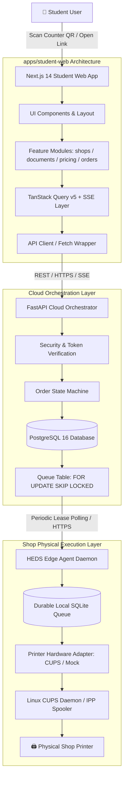
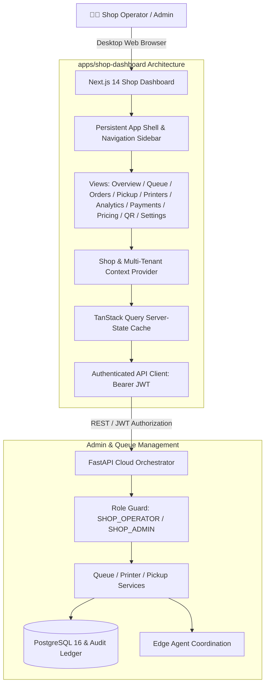

# HEDS Frontend Architecture Specification

**Applications:**
1. `apps/student-web` (Student Mobile-First PWA)
2. `apps/shop-dashboard` (Shop Operator Console)

**Framework:** Next.js 14 (App Router) + TypeScript + Tailwind CSS  
**State & Data Synchronization:** TanStack React Query v5 + Server-Sent Events (SSE) fallback  
**Icons & Design Primitives:** Lucide React, Clean Industrial Design System Tokens  

---

## 1. System-Wide Architectural Diagrams

### A. End-to-End Student Processing Layer



### B. Shop Operator Console Architecture



---

## 2. Frontend Overview & Design Principles

HEDS serves two distinct user personas with fundamentally different operational needs:

1. **Student / Customer Persona (`student-web`):**
   * **Goal:** Zero friction, zero signups. Upload file, choose settings, pay, monitor live progress, present OTP at the counter.
   * **Device Profile:** Mobile-first smartphones, mobile Safari/Chrome, scanning physical QR codes at college print counters.
   * **UX Mandate:** Fast loading (< 200KB initial bundle), instant visual feedback, clear price breakdown, perforated ticket token, prominent pickup OTP.

2. **Shop Operator Persona (`shop-dashboard`):**
   * **Goal:** High-throughput print management, queue monitoring, paper/jam recovery, cash/UPI reconciliation, hardware health inspection.
   * **Device Profile:** Desktop computers, POS counter terminals, 1080p+ monitors.
   * **UX Mandate:** High clarity, clean light-mode surfaces (`bg-slate-50`), crisp dark text, primary HEDS Blue accents, zero glowing borders, instant operational legibility ("What is happening right now?", "What do I need to do?", "Is everything working?").

---

## 3. Student Application Architecture (`apps/student-web`)

### Directory Layout
```text
apps/student-web/src/
├── app/
│   ├── layout.tsx              # Root HTML shell, QueryProvider, Toast notifications
│   ├── page.tsx                # Fallback / Landing (directs to scan QR)
│   ├── globals.css             # Tailwind configuration & design tokens
│   ├── s/
│   │   └── [shop_slug]/
│   │       └── page.tsx        # Counter landing: Upload, Configure, Preview, Checkout
│   └── orders/
│       └── [guest_token]/
│           └── page.tsx        # Live order logistics tracker & Privacy Hold OTP
├── components/
│   ├── ui/                     # Primitives: Button, Badge, StatusDot, Modal
│   └── layout/                 # Navigation, Mobile Container, Header
├── lib/
│   ├── api.ts                  # Typed Fetch wrapper with standard error handling
│   └── queryClient.ts          # Configured TanStack Query client
└── types/                      # Type definitions for shops, orders, pricing
```

### Route Lifecycle:
1. **`/s/[shop_slug]`**:
   * Reads `shop_slug` from path params.
   * Queries `GET /api/v1/shops/{shop_slug}` via TanStack Query.
   * If `is_queue_paused`, displays notice and disables submission button.
   * On file selection: validates extension (PDF, PNG, JPG) and size (max 50MB).
   * Calculates local price preview based on authoritative shop rates.
   * Submits `multipart/form-data` to `POST /api/v1/shops/{shop_slug}/orders`.
   * On 200 OK, executes payment intent `POST /api/v1/orders/{guest_token}/payment`.
   * Redirects to `/orders/{guest_token}`.
2. **`/orders/[guest_token]`**:
   * Fetches `GET /api/v1/orders/{guest_token}`.
   * Subscribes to real-time status updates via SSE (`/api/v1/orders/{guest_token}/events`) with polling fallback.
   * When `PICKUP_READY`: Displays perforated ticket with large 6-digit Privacy Hold OTP code and counter pickup instructions.
   * When `COMPLETED`: Automatically stops polling and presents completion receipt.

---

## 4. Shop Dashboard Architecture (`apps/shop-dashboard`)

### Directory Layout
```text
apps/shop-dashboard/src/
├── app/
│   ├── layout.tsx              # Root HTML shell, QueryProvider
│   ├── page.tsx                # Index redirect to /dashboard or /login
│   ├── login/
│   │   └── page.tsx            # Operator email/password authentication (clean minimal card)
│   └── dashboard/
│       └── page.tsx            # Operations shell hosting all views
├── components/
│   ├── layout/
│   │   ├── Sidebar.tsx         # Persistent left navigation with badge counts
│   │   └── Header.tsx          # Current shop indicator, pause/resume toggle, operator profile
│   ├── ui/
│   │   ├── Button.tsx          # Primary HEDS Blue, white secondary, danger, ghost
│   │   ├── Badge.tsx           # Semantic light pastel status badges
│   │   ├── Input.tsx           # Standard text, number, and search inputs
│   │   ├── Modal.tsx           # Accessible keyboard-navigable dialogs
│   │   └── EmptyState.tsx      # Clean zero-data placeholders
│   └── views/
│       ├── OverviewView.tsx    # Today's Summary metrics, Current Printing hero card, Up Next, Ready, Printers
│       ├── QueueView.tsx       # Live print job table with Retry/Cancel/Reconcile and filter pills
│       ├── OrdersView.tsx      # Historical order log with status filters & search
│       ├── PickupView.tsx      # POS counter terminal with 6-digit OTP verification keypad
│       ├── PrintersView.tsx    # Hardware health, active job, capabilities, diagnostics trigger
│       ├── AnalyticsView.tsx   # Business metrics, walk-in distribution, print ratio charts
│       ├── PaymentsView.tsx    # Financial settlement ledger
│       ├── PricingView.tsx     # Rate editing cards (B&W, Color, Duplex, Min)
│       ├── AuditLogsView.tsx   # Immutable security audit trail
│       ├── QrView.tsx          # Printable A4 counter flyer with real SVG QR matrix
│       └── SettingsView.tsx    # Queue pause toggle and privacy policies
├── lib/
│   ├── api.ts                  # Authenticated client with automatic Bearer token
│   └── queryClient.ts          # Centralized QueryClient with retry & cache defaults
└── types/                      # Domain interfaces
```

---

## 5. Design System Tokens & Color Palette

The user interface follows a professional productivity software design standard (clean light mode surfaces, HEDS Blue brand identity):

### Color System
- **Brand Primary:** HEDS Blue (`#2563EB` / `rgb(37, 99, 235)`)
- **Background Surfaces:** Canvas `bg-slate-50`, Card surfaces `bg-white`, Borders `border-slate-200`
- **Text:** Primary headings `text-slate-900`, Body `text-slate-700`, Secondary/Muted `text-slate-500`
- **Status Colors:**
  - `SUCCESS`: Emerald (`bg-emerald-50 text-emerald-700 border-emerald-200`)
  - `WARNING / RECONCILING`: Amber (`bg-amber-50 text-amber-700 border-amber-200`)
  - `ERROR / FAILED`: Red (`bg-rose-50 text-rose-700 border-rose-200`)
  - `PRINTING / ACTIVE`: Blue (`bg-blue-50 text-blue-700 border-blue-200`)
  - `QUEUED`: Slate (`bg-slate-100 text-slate-700 border-slate-200`)

### Typography
- Primary Sans-Serif: `Inter` or modern system sans-serif.
- Monospace (`font-mono`): Restrained exclusively to Token IDs (`#27`), OTPs (`382910`), currency amounts (`₹8.00`), and hardware identifiers.

---

## 6. Authentication & Security Boundaries

1. **Guest Student Access:**
   * URL-safe 32-byte cryptographic token (`guest_access_token`).
   * No registration, passwords, or personal profiles required.
   * Scoped strictly to the specific order's status and pickup OTP.
2. **Shop Operator Authorization:**
   * JWT bearer tokens (`HS256`, 24h expiration) issued via `POST /api/v1/auth/login`.
   * Automatically attached via authenticated API wrapper.
   * Role-based access control (`SHOP_OPERATOR`, `SHOP_ADMIN`).
