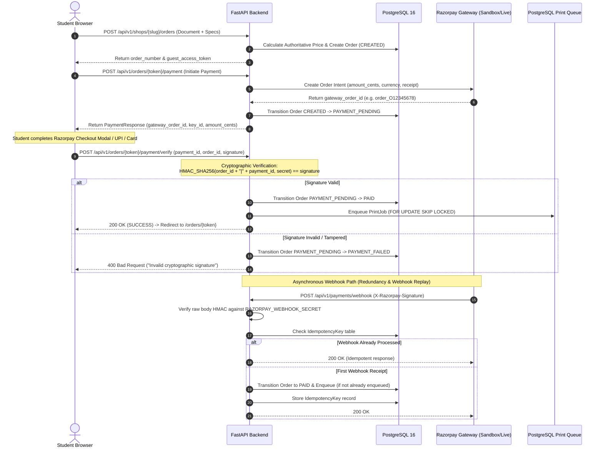

# HEDS Payment Subsystem Architecture

**Status:** Mock Implemented & Verified | Razorpay Sandbox Interface Active & Verified  
**Authoritative Source of Truth:** FastAPI Cloud Orchestrator (`backend/app/api/v1/payments.py`)  
**Cryptographic Algorithm:** HMAC-SHA256 (RFC 2104)  
**Currencies Supported:** INR (Minor Units: Paise)  

---

## 1. Executive Summary

In high-density campus print environments, payment ambiguity creates customer friction, delayed pickups, and financial losses. HEDS implements a **strictly authoritative, server-verified payment model**:
1. **Integer Minor Units:** All prices are computed server-side in integer paise (e.g. ₹8.50 = `850` paise) to prevent floating-point discrepancies.
2. **Never Trust Client Claims:** A client claiming "Payment Successful" is never sufficient to initiate printing. Print jobs are enqueued **only after** authoritative HMAC-SHA256 cryptographic signature verification or gateway webhook receipt.
3. **Pluggable Payment Gateway Abstraction:** A clean `PaymentGateway` interface supports both local simulated execution (`MockPaymentGateway`) and live or sandbox Razorpay checkouts (`RazorpayPaymentGateway`).
4. **Strict Idempotency:** Duplicate payment submissions or repeated webhooks never produce duplicate print jobs or double debits.

---

## 2. End-to-End Payment Flow

---

## 3. Cryptographic Verification Standard

### Client-Side Payment Verification (`POST /orders/{guest_token}/payment/verify`)
When the student completes the Razorpay Checkout modal, the frontend receives:
- `razorpay_payment_id` (e.g. `pay_29QQoUBi66xm2f`)
- `razorpay_order_id` (e.g. `order_9A33XWu170gUtm`)
- `razorpay_signature` (Hex-encoded HMAC-SHA256 string)

The backend reconstructs the payload:
$$\text{payload} = \text{razorpay\_order\_id} \parallel \text{"|"} \parallel \text{razorpay\_payment\_id}$$
Calculates:
$$\text{expected} = \text{HMAC-SHA256}(\text{key\_secret}, \text{payload})$$
And performs a constant-time comparison using `hmac.compare_digest(expected, signature)`. If verification succeeds, the order transitions to `PAID` and `queue_service.enqueue_order()` places the job in the printer queue.

### Asynchronous Webhook Verification (`POST /payments/webhook`)
Razorpay delivers event notifications (e.g. `payment.captured`) with the `X-Razorpay-Signature` header:
$$\text{expected} = \text{HMAC-SHA256}(\text{webhook\_secret}, \text{raw\_request\_body})$$
- If `RAZORPAY_WEBHOOK_SECRET` is configured and signature does not match, the request is immediately rejected with HTTP 400.
- Safe payload extraction accommodates both flat test payloads and official nested Razorpay schemas (`payload.payment.entity.order_id`).

---

## 4. Payment States & State Machine Integrity

Payments transition strictly through defined states:
- `CREATED`: Order price calculated, awaiting checkout initiation.
- `PAYMENT_PENDING`: Checkout session active; payment intent created with gateway.
- `PAID`: Authoritatively verified; print job safely in queue.
- `PAYMENT_FAILED`: Signature check failed, card declined, or cancelled by student.
- `REFUND_PENDING` / `REFUNDED`: Managed through `PaymentGateway.refund_payment()`.

If a payment fails, the student can safely retry checkout; `OrderState.PAYMENT_FAILED` transitions safely back to `PAYMENT_PENDING` on retry.

---

## 5. Configuration & Environment Flags

| Variable | Default (Dev) | Production / Sandbox |
|---|:---:|---|
| `PAYMENT_GATEWAY` | `mock` | `razorpay` |
| `RAZORPAY_KEY_ID` | `""` | `rzp_test_...` (Sandbox) / `rzp_live_...` |
| `RAZORPAY_KEY_SECRET` | `""` | Razorpay Merchant Secret |
| `RAZORPAY_WEBHOOK_SECRET` | `""` | Razorpay Webhook Secret |

In development mode (`PAYMENT_GATEWAY=mock`), checkouts complete instantly with realistic tokens, enabling seamless offline and local unit test workflows without external API dependencies.
