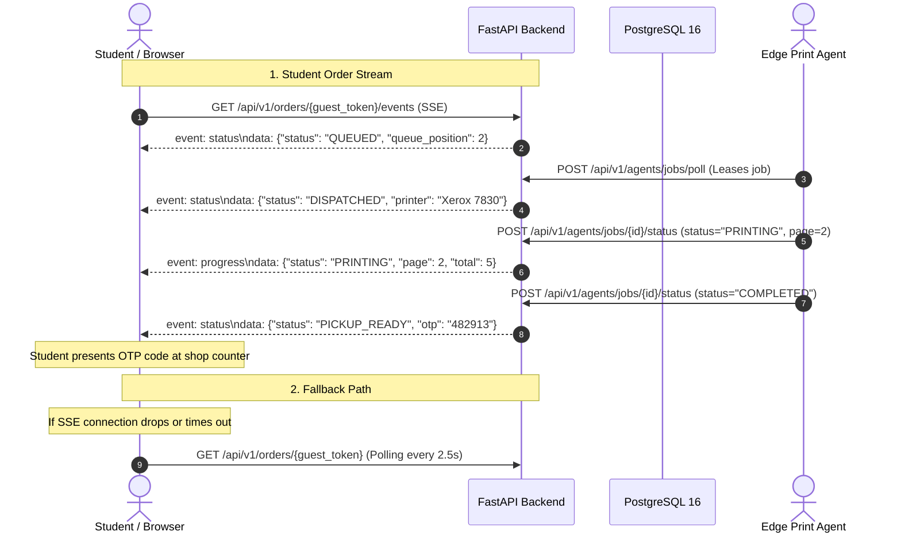

# HEDS Real-Time Status Architecture: SSE Primary with Polling Fallback

**Document Status:** Architectural Specification & Implementation Guide  
**Protocols:** Server-Sent Events (`text/event-stream`, HTTP/1.1 or HTTP/2) + Polling Fallback (HTTP GET)  
**Security Boundary:** Scoped URL Tokens (`guest_access_token`) & Operator JWT (`Authorization: Bearer <token>`)  

---

## 1. Executive Summary

In high-throughput campus print shops, customer satisfaction depends on immediate feedback once paper spooling begins, and shop operators need immediate visual notice when a printer errors or a job enters `RECONCILING`.

While WebSocket protocols introduce stateful TCP connection overhead, firewall traversal friction, and complex reconnection clustering, **Server-Sent Events (SSE)** provide:
1. **Unidirectional Push:** The server pushes lightweight JSON events over standard HTTPS.
2. **HTTP/2 Multiplexing:** Multiple streams over a single connection.
3. **Native Browser Reconnection:** The browser automatically reconnects if the link flaps.
4. **Resilient Fallback:** If the browser or intermediate proxy terminates the SSE stream, client hooks seamlessly fall back to deterministic TanStack Query polling.

---

## 2. Real-Time Event Topology

---

## 3. Student Event Lifecycle

When a student places an order:
1. **Order Created / Paid:** Client navigates to `/orders/[guest_token]`.
2. **SSE Connection Initialized:** `EventSource` connects to `/api/v1/orders/{guest_token}/events`.
3. **State Streaming:**
   * `QUEUED`: Emits queue position and estimated wait time.
   * `DISPATCHED`: Emits assigned hardware printer queue.
   * `PRINTING`: Emits page spooling increments (`progress_page: N`).
   * `PRINT_COMPLETED` $\rightarrow$ `PICKUP_READY`: Emits the 6-digit Privacy Hold OTP.
   * `COMPLETED`: Emits final pickup confirmation, closing the SSE connection.
4. **Fallback:** If `EventSource.onerror` fires, the client seamlessly switches to TanStack Query interval polling (`refetchInterval: 2500ms`).

---

## 4. Shop Operator Event Lifecycle

When an operator opens `/dashboard`:
1. **SSE Channel Initialized:** `EventSource` connects to `/api/v1/shop/{shop_id}/events` with authorized credentials.
2. **Events Dispatched:**
   * `QUEUE_MUTATION`: Emitted whenever a job is queued, leased, retried, or cancelled.
   * `HARDWARE_TELEMETRY`: Emitted when an edge agent heartbeats with updated printer status (`ONLINE`, `BUSY`, `ERROR`).
   * `RECONCILIATION_ALERT`: Emitted immediately when a lease expires or hardware disconnects mid-print.
3. **Fallback:** If intermediate proxy drops SSE, TanStack Query 3-second polling maintains live state.

---

## 5. Architectural Invariants

* **Backend Remains Authoritative:** Real-time events are read-only notifications. State transitions must still occur through `OrderStateMachine.transition()`.
* **Idempotent Consumers:** Client logic must handle receiving duplicate events or out-of-order SSE payloads without inconsistent state.
* **Connection Lifecycle Management:** SSE connections timeout after 120 seconds of silence; clients send heartbeat ping comments (`: keep-alive\n\n`) every 15 seconds.
